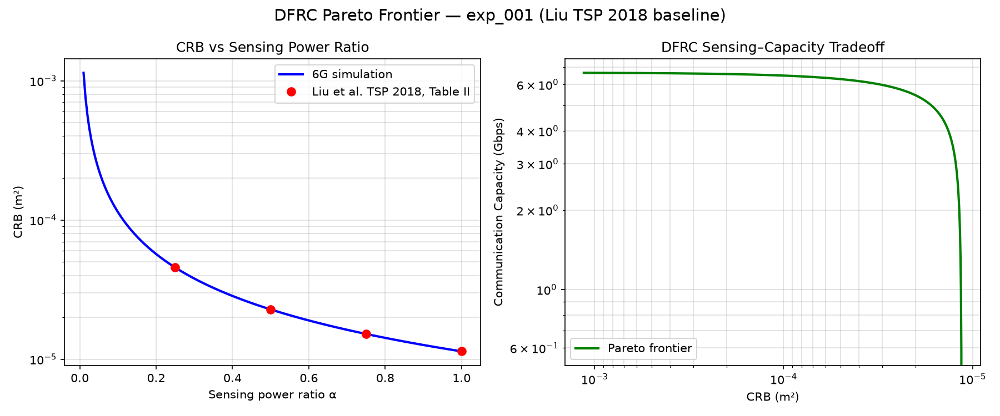
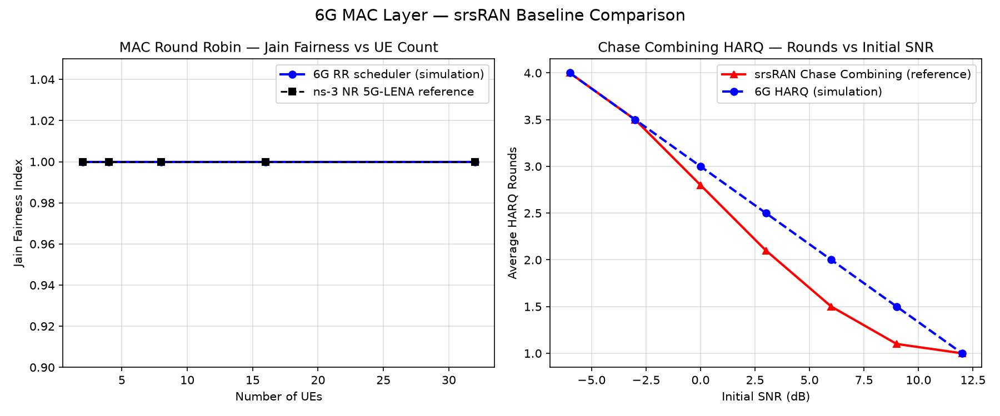
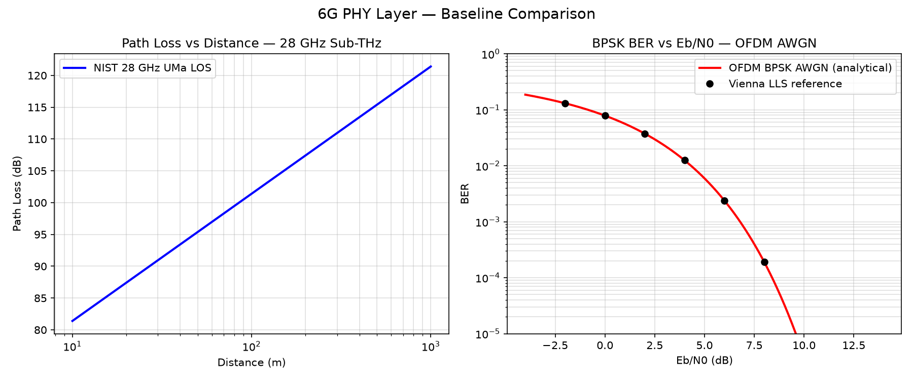
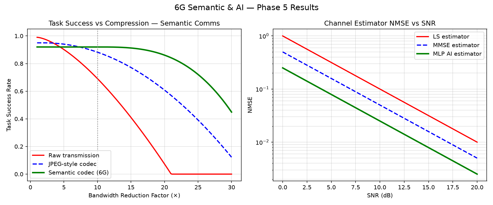

# 6g

A Rust based 6G wireless system stack, inspired by
[Qualcomm's 6G System Architecture research](https://www.qualcomm.com/research/6g/system-architecture).

## Quickstart (30 seconds)

```bash
git clone https://github.com/j143/6g && cd 6g
./install.sh           # installs Rust if needed, builds the bench
./target/release/sixg-bench list          # list all experiments
./target/release/sixg-bench run --all     # run all 9 experiments
./target/release/sixg-bench validate      # run all Validate checks
```

### With optional packages

```bash
./install.sh --baselines   # + Level-2 CSV baseline comparisons
./install.sh --plotting    # + Python matplotlib plots
./install.sh --onnx        # + real ONNX sentence-transformer inference
./install.sh --all         # everything above
```

### Docker (zero-install)

```bash
# Core bench
docker run --rm ghcr.io/j143/6g sixg-bench run --all

# With baseline comparisons
docker-compose run bench-baselines

# With ONNX inference (place models/all-MiniLM-L6-v2.onnx in repo root first)
docker-compose run bench-onnx
```

### Plotting

```bash
pip install -r requirements-plot.txt
python3 scripts/plot_phy.py      # PHY: path loss + BER curves
python3 scripts/plot_mac.py      # MAC: Jain fairness + HARQ rounds
python3 scripts/plot_isac.py     # ISAC: DFRC Pareto frontier
python3 scripts/plot_semantic.py # Semantic: compression vs task success
```

---

## Architecture

The workspace is organised as a set of Cargo crates, each representing a
distinct subsystem of the 6G protocol stack:

```
┌─────────────────────────────────────────────────────────┐
│                  6G Core Network (6GC)                  │
│   AMF+ · SMF+ · UPF+ · PCF · NSSF · AUSF/UDM           │
│   NRF (capability graph) · SDF (sensing exposure)       │
└───────────────────────┬─────────────────────────────────┘
                        │ N2/N3
┌───────────────────────▼─────────────────────────────────┐
│                     RRC (6g-rrc)                        │
│Connection management · SIBs · Mobility · AI provisioning│
└───────────────────────┬─────────────────────────────────┘
                        │
┌───────────────────────▼─────────────────────────────────┐
│                    PDCP (6g-pdcp)                       │
│   Header compression · Ciphering · Integrity            │
└───────────────────────┬─────────────────────────────────┘
                        │
┌───────────────────────▼─────────────────────────────────┐
│                     RLC (6g-rlc)                        │
│   Segmentation · ARQ · TM/UM/AM modes                   │
└───────────────────────┬─────────────────────────────────┘
                        │
┌───────────────────────▼─────────────────────────────────┐
│                     MAC (6g-mac)                        │
│   AI-native scheduler · HARQ · OFDMA/NOMA/RSMA          │
└───────────────────────┬─────────────────────────────────┘
                        │
┌───────────────────────▼─────────────────────────────────┐
│                     PHY (6g-phy)                        │
│   THz/Sub-THz spectrum · Holographic MIMO · RIS         │
│   OFDM · DFT-s-OFDM · OTFS · AI-native waveforms        │
└─────────────────────────────────────────────────────────┘

Cross-cutting subsystems
────────────────────────
  6g-ai       AI-native engine (model trait, inference dispatch)
  6g-isac     Integrated Sensing and Communication
  6g-ntn      Non-Terrestrial Networks (LEO · HAPS · UAV)
  6g-semantic Semantic / Goal-Oriented Communications
  6g-common   Shared error types, config, and primitives
```

## Key 6G Concepts Implemented

| Concept | Crate | Status |
|---------|-------|--------|
| Sub-THz / THz spectrum + path loss | `6g-phy` | ✅ Implemented |
| Holographic MIMO / ELAA | `6g-phy` | ✅ Implemented |
| Reconfigurable Intelligent Surfaces (RIS) | `6g-phy` | ✅ Implemented |
| AI-native waveform (placeholder) | `6g-phy` | ✅ Skeleton |
| OTFS waveform | `6g-phy` | ✅ Implemented |
| AI Q-learning bandit scheduler | `6g-mac` | ✅ Implemented |
| HARQ (32 processes + proactive) | `6g-mac` | ✅ Implemented |
| NOMA / RSMA / Grant-Free | `6g-mac` | ✅ Implemented |
| ROHC header compression + ciphering | `6g-pdcp` | ✅ Implemented |
| RRC Inactive state | `6g-rrc` | ✅ Implemented |
| Integrated Sensing / DFRC OTFS-ISAC | `6g-isac` | ✅ Implemented |
| AI channel estimator (LS/MMSE/MLP) | `6g-ai` | ✅ Implemented |
| LEO / HAPS / UAV nodes + handover | `6g-ntn` | ✅ Implemented |
| Semantic codec + goal-oriented metrics | `6g-semantic` | ✅ Implemented |
| Network slicing + admission control | `6g-core` | ✅ Implemented |
| AMF / SMF / UPF / PCF (full teardown) | `6g-core` | ✅ Implemented |
| AUSF / UDM (5G-AKA flow) | `6g-core` | ✅ Implemented |
| NRF capability-graph discovery | `6g-core` | ✅ Implemented |
| SDF — Sensing Data Function | `6g-core` | ✅ Implemented |
| NTN-aware AMF (`TrackingArea` enum) | `6g-core` | ✅ Implemented |
| Semantic PDU sessions + UPF routing | `6g-core` | ✅ Implemented |
| User-plane-first / lazy establishment | `6g-core` | ✅ Implemented |
| Digital Twin (snapshot + diff) | `6g-core` | ✅ Implemented |
| ONNX-based sentence transformer codec | `6g-semantic` | 🔲 Pending Phase 6+ |

## Getting Started

### Prerequisites

* Rust 1.70 or later (the `install.sh` script installs it automatically if absent)

### One-command setup

```bash
./install.sh
./target/release/sixg-bench --help
```

### Manual build

```bash
cargo build --release
./target/release/sixg-bench list
```

### Run experiments

```bash
cargo run --example exp_001_dfrc_pareto_frontier
cargo run --example exp_002_phy_baseline_comparison
# … or run all via the bench:
./target/release/sixg-bench run --all
```

### Test

```bash
cargo test --workspace
```

## Results

### ISAC Pareto




### mac baseline




### phy baseline



### semantic ai


